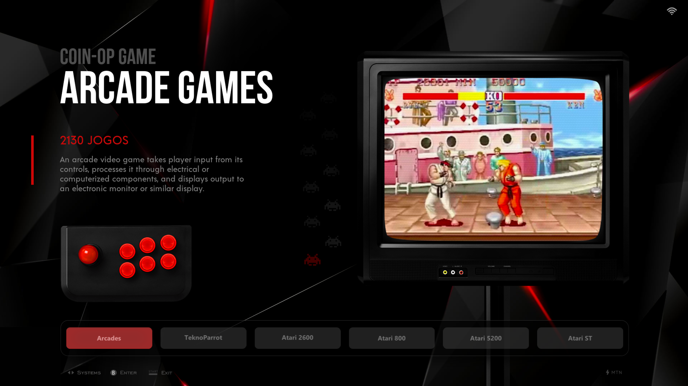
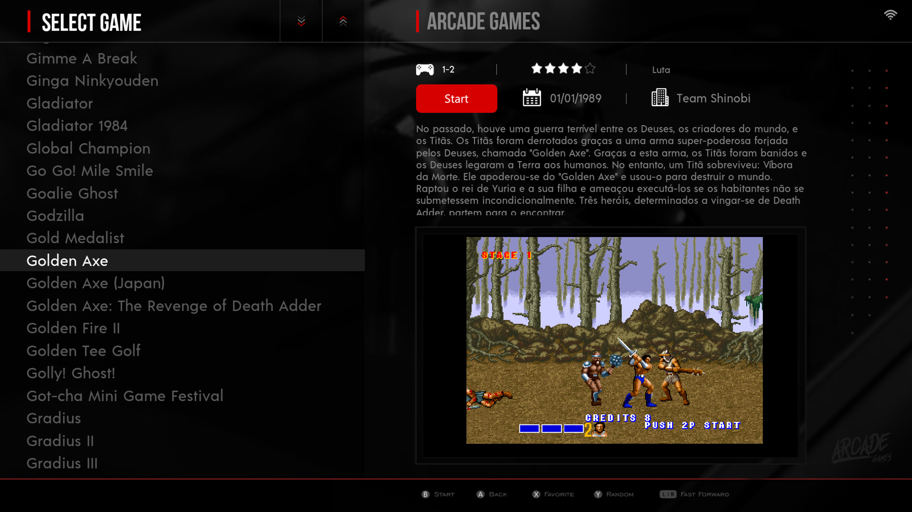
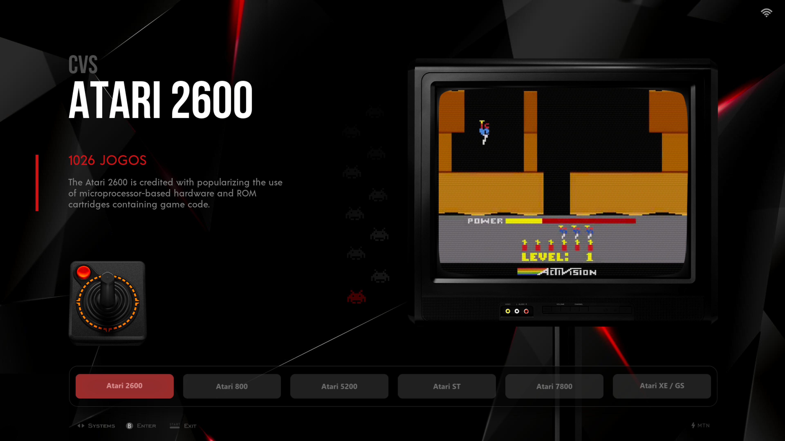
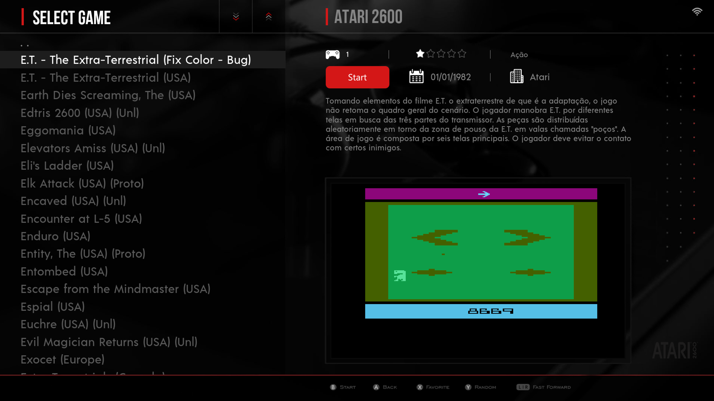
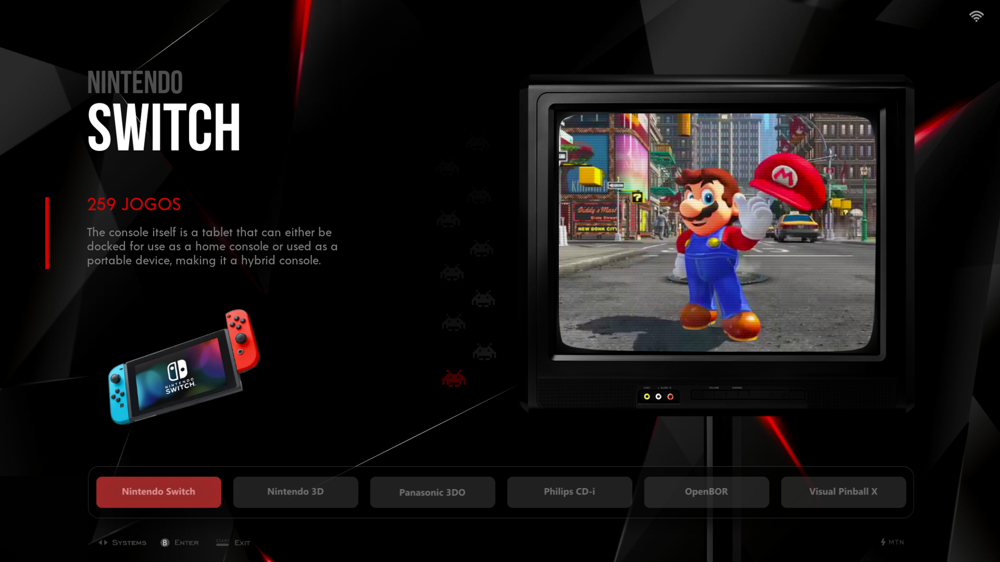
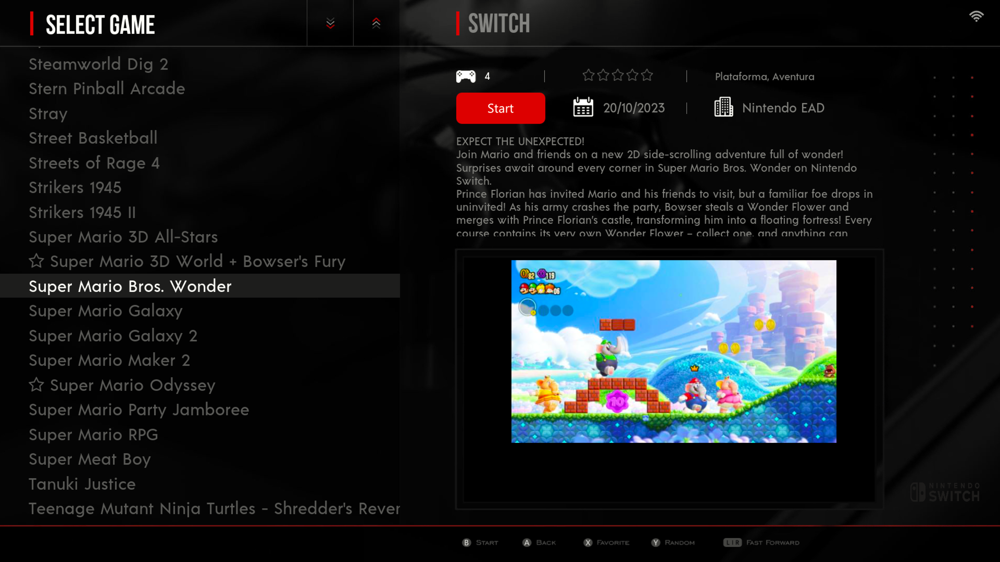

CRT-Modern-Dark is the perfect theme if you’re tired of visual clutter and color schemes that look like a kids' party arcade cabinet. Try something minimalist, sophisticated, and pleasing—both in terms of navigation and its sleek dark aesthetic—that reflects impeccable taste.

CRT-Modern-Dark supports the major systems used in Batocera, including new ones that lack official support elsewhere—such as Nintendo Switch, Game Music Emulator, Nes3D, Mega Drive MD+, ZX Spectrum NEXT, AmigaVision, Teknoparrot, and more ^_^

Compatibility: ✅ Runs on batocera Stable (current version: 43.1).

CRT-Modern-Dark THeme is Emulationstation Theme for Batocera, RetroBat, EmuELEC.

* **Download 1:** [Baixar via Google Drive](https://drive.google.com/file/d/1R8N5fOC-mFXDQ29FUqajc_3tXcO3PvEX/view?usp=drive_link)
* **Download 2:** [Baixar Tema (.ZIP)](https://github.com/marcelosofth/es-theme-CRT-Modern-Dark/archive/refs/heads/main.zip)

THeme by MTN
## Licence

Attribution-NonCommercial-ShareAlike 4.0 International (CC BY-NC-SA 4.0)

https://creativecommons.org/licenses/by-nc-sa/4.0/

Creative Commons Attribution-NonCommercial-ShareAlike 4.0 International Public License

You are free to:

* **Share:** copy and redistribute the material in any medium or format
* **Adapt:** remix, transform, and build upon the material

Under the following terms:

**Attribution:** You must give appropriate credit, provide a link to the license, and indicate if changes were made. You may do so in any reasonable manner, but not in any way that suggests the licensor endorses you or your use.

**NonCommercial:** You may not use the material for commercial purposes.

**ShareAlike:** If you remix, transform, or build upon the material, you must distribute your contributions under the same license as the original.

No additional restrictions — You may not apply legal terms or technological measures that legally restrict others from doing anything the license permits.
